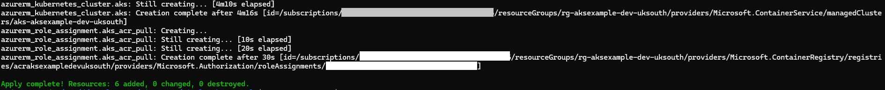

# Simple AKS Example

This repo contains the code to deploy a simple Azure Kubernetes Service cluster using Terraform, and present a "Hello World" Python-based web application.

You will need to be owner of a subscription if you would like to create all the resources this guide will walk you through.

> Disclaimer: Please remember to clean-up any resources you deploy whilst following this guide, to avoid any expected Azure costs.

All steps were carried out using a Windows 11 PC - your mileage may vary.

## Prerequesites

Software used during this process:

- Azure CLI
- Terraform
- KubeCTL
- Docker Desktop

For more information on setting up your PC to run this code, here is a Microsoft Learn guide - [Install Terraform on Windows with Bash](https://learn.microsoft.com/en-us/azure/developer/terraform/get-started-windows-bash)

### A Note on Using WSL

If you're using WSL with Ubuntu, you may need to install these snap packages:

```bash
sudo snap install terraform --classic
sudo snap install kubectl --classic
```

That said, I did struggle to get kubectl working in WSL - it could not contact the relay running on my PC it needed to access the AKS API. In the end I used KubeCTL with PowerShell.

## Setup

Log into Azure:

```bash
az login
```

Create environment variables to use with the deployment:

```bash
# Terraform State resources (backend)
tfstate_resource_group_name="rg-tfstate-uksouth"
tfstate_location="uksouth"
tfstate_storage_account_name="sttfstateuksouth0211"
tfstate_container_name="tfstate"
tfstate_file_name="aks-example-dev.tfstate"
```

Create a Storage Account for holding TF State:

```bash
# Create resource group
az group create --name $tfstate_resource_group_name --location $tfstate_location

# Create storage account
az storage account create --name $tfstate_storage_account_name --resource-group $tfstate_resource_group_name --sku Standard_LRS --encryption-services blob

# Create a secure Storage Account
az storage account create \
  --name $tfstate_storage_account_name \
  --resource-group $tfstate_resource_group_name \
  --location $tfstate_location \
  --sku Standard_LRS \
  --kind StorageV2 \
  --https-only true \
  --default-action Deny \
  --bypass AzureServices

# Create a network rule so only you can access the storage account
my_ip_address=$(curl https://api.ipify.org)
az storage account network-rule add \
  --account-name $tfstate_storage_account_name \
  --resource-group $tfstate_resource_group_name \
  --ip-address $my_ip_address

# Create blob container
az storage container create --name $tfstate_container_name --account-name $tfstate_storage_account_name
```


Create environment variables to use with Terraform:

```bash
# Fetch subscription Info
echo "Fetching Azure subscription info..."
subscription_id=$(az account show --query "id" -o tsv | sed 's/\r//')
tenant_id=$(az account show --query "tenantId" -o tsv | sed 's/\r//')

# Fetch storage account key
echo "Fetching Azure storage account key..."
access_key=$(az storage account keys list \
  --account-name $tfstate_storage_account_name \
  --resource-group $tfstate_resource_group_name \
  --query "[0].value" -o tsv)

# Set the Environment vars required by the AzureRM provider - Confirm with: printenv | grep ARM_
export ARM_SUBSCRIPTION_ID="$subscription_id"
export ARM_TENANT_ID="$tenant_id"
export ARM_ACCESS_KEY="$access_key"

# Set Resource tags - Confirm with: printenv | grep TF_VAR_
export TF_VAR_tags='{"Environment":"Development"}'

# Set Baseline resources
export TF_VAR_resource_group_name='rg-aksexample-dev-uksouth'
export TF_VAR_location='uksouth'

# Set AKS resources
export TF_VAR_virtual_network_name='vnet-aksexample-dev-uksouth'
export TF_VAR_virtual_network_address_space='["192.168.18.0/23"]'
export TF_VAR_aks_subnet_name='snet-aksexample-dev-uksouth'
export TF_VAR_aks_subnet_address_prefixes='["192.168.18.0/23"]'
export TF_VAR_aks_cluster_name='aks-aksexample-dev-uksouth'
export TF_VAR_aks_dns_prefix='aksexample-uksouth'
export TF_VAR_aks_kubernetes_version=1.30
export TF_VAR_aks_node_resource_group_name='aksnrg-aksexample-dev-uksouth'
export TF_VAR_aks_default_node_pool_name='linuxsysnp'
export TF_VAR_aks_default_node_pool_vm_size='Standard_B2ms'
export TF_VAR_aks_default_node_pool_os_sku='Ubuntu'
export TF_VAR_aks_default_node_pool_os_disk_size_gb=30
export TF_VAR_aks_default_node_pool_minimum_node_count=1
export TF_VAR_aks_default_node_pool_maximum_node_count=2
export TF_VAR_aks_default_node_pool_availability_zones='["1","2","3"]'
export TF_VAR_acr_name='acraksexampledevuksouth'
export TF_VAR_acr_sku='Basic'
```

## Deployment

Initialize Terraform:

```bash
# Initialize Terraform and download AzureRM provider
terraform -chdir=terraform init \
  -backend-config="resource_group_name=$tfstate_resource_group_name" \
  -backend-config="storage_account_name=$tfstate_storage_account_name" \
  -backend-config="container_name=$tfstate_container_name" \
  -backend-config="key=$tfstate_file_name"
```


Create an add/change plan:

```bash
# Create a plan of the resources to add/change
terraform -chdir=terraform  plan -out aks-example-dev.tfplan
```

Apply the add/change plan:

```bash
# Add/change the resources covered in the plan
terraform -chdir=terraform  apply aks-example-dev.tfplan
```



> Note: The deployment should take around 5 minutes to complete

## AKS Inspection

```bash
# Get overview using Azure CLI
az aks show \
  --name $TF_VAR_aks_cluster_name \
  --resource-group $TF_VAR_resource_group_name \
  --output table

# Get nodepools using Azure CLI
az aks nodepool list \
  --cluster-name $TF_VAR_aks_cluster_name \
  --resource-group $TF_VAR_resource_group_name \
  --output table

# Get Cluster credentials and set to current context
az aks get-credentials --name $TF_VAR_aks_cluster_name --resource-group $TF_VAR_resource_group_name

# List all k8s objects from Cluster Control plane
kubectl get all --all-namespaces
```

## Build and Deploy a Hello World App

Build the app locally using Docker:

```Bash
# Build the dockerfile for the hello world app locally
docker build -t hello-world-app .

# Run the Docker container locally - CTRL+C to quit
docker run -p 5000:5000 hello-world-app
```

Upload the Docker image to the ACR:

```bash
# Isolate the ACR for token replacement
export ACR_NAME=$TF_VAR_acr_name

# Login into the ACR using Entra/AAD auth
az acr login --name $ACR_NAME

# Tag the Docker image and confirm
docker tag hello-world-app $ACR_NAME.azurecr.io/hello-world-app:v1
docker image ls | grep hello

# Push the image to the ACR
docker push $ACR_NAME.azurecr.io/hello-world-app:v1

# Confirm the image has been uploaded
az acr repository list --name $ACR_NAME
```


Serve the Hello World app using AKS:

```bash
# Substitute tokens to create the deployment file - the ACR name needs to reflect what was deployed
envsubst < kube-manifests/01-deployment.template.yml > kube-manifests/01-deployment.yml

# Publish the app using the yml files
kubectl apply -f kube-manifests/01-deployment.yml
kubectl apply -f kube-manifests/02-service.yml

# Confirm the pods, deployment and service
kubectl get pods
kubectl get deployment
kubectl get service
```

Here's a view from the Azure Portal for comparison:


Browse to the External-IP to see the Hello World app in all its (not) glory:


## Clean-up

You don't technically need to delete the app from AKS but here are the commands:

```bash
# Unpublish the app using the yml files
kubectl delete -f kube-manifests/02-service.yml
kubectl delete -f kube-manifests/01-deployment.yml
```

Use Terraform to destroy the resources it deployed.

Create destroy plan:

```bash
# Create a plan of the resources to destroy
terraform -chdir=terraform  plan -destroy -out aks-example-dev.tfplan
```

Apply the destroy plan:

```bash
# Destroy the resources covered in the plan
terraform -chdir=terraform  apply -destroy aks-example-dev.tfplan
```

> Note: If you're totally done with this example, remember to remove the Terraform state storage account and resource group.
